# 流匹配
参考: https://www.bilibili.com/video/BV142C2BSEbm/?spm_id_from=333.337.search-card.all.click&vd_source=4a6d0e6c1edd8cf37a14f863a7a4c8ed

## 思想
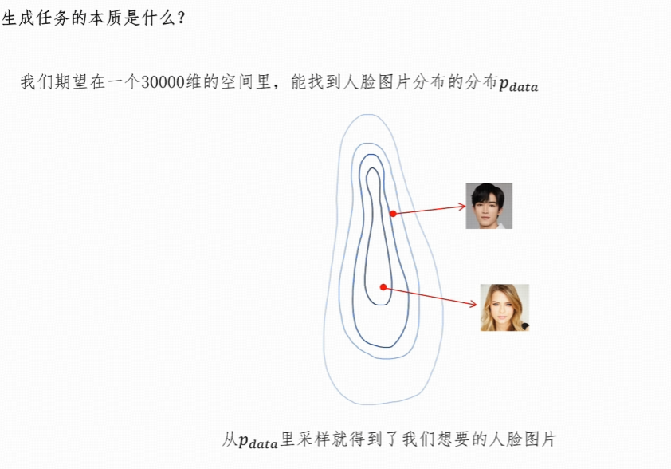
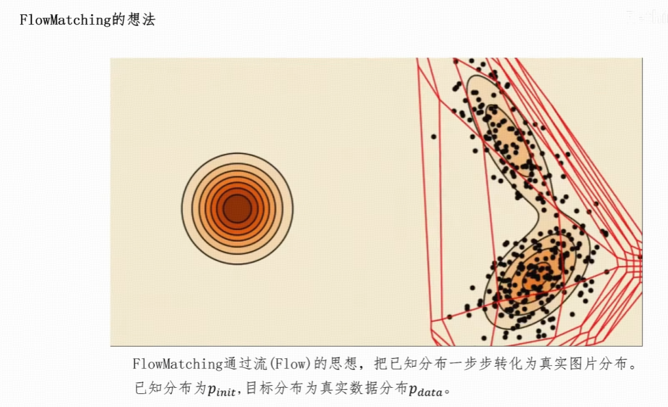
## 概念引入

### 轨迹
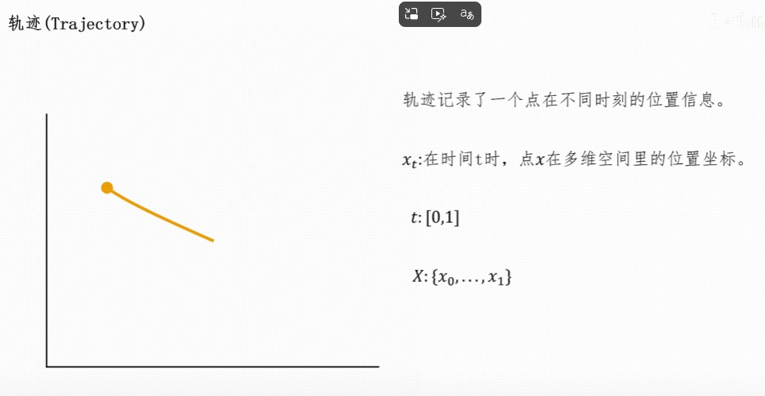

### 向量场/速度场
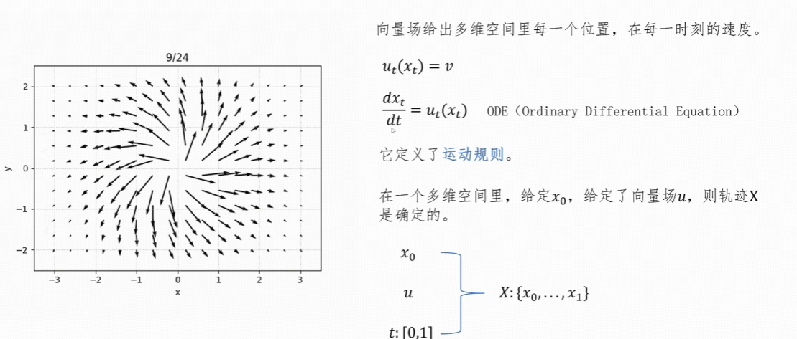

### 流的概念
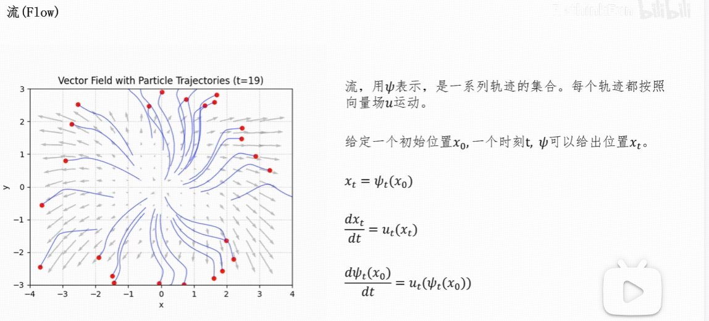

### FlowMatching的想法
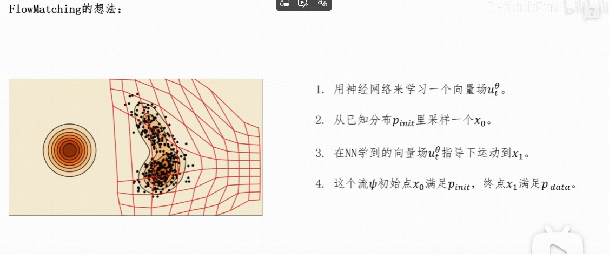
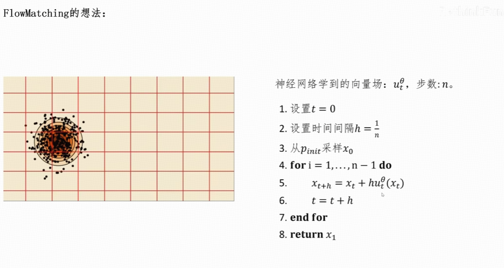

### 神经网络目的学习一个向量场

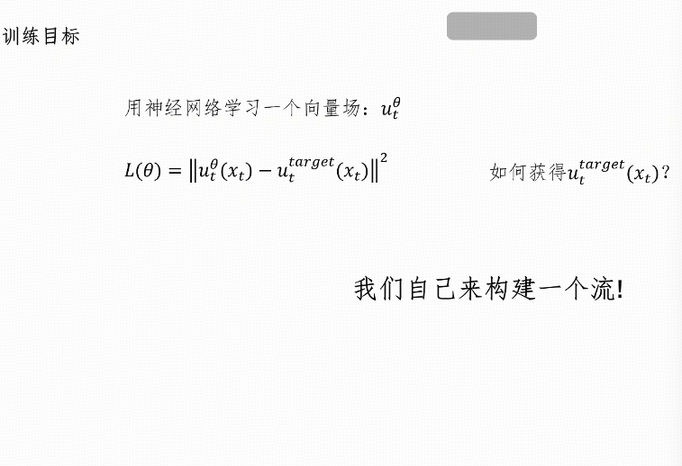

### 概率密度

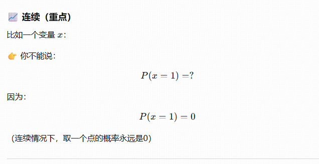
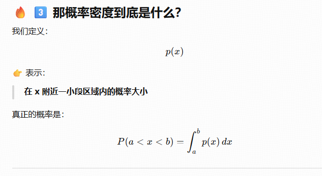
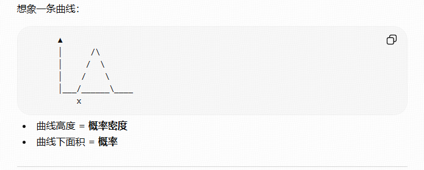

### 概率密度汇集到一个点

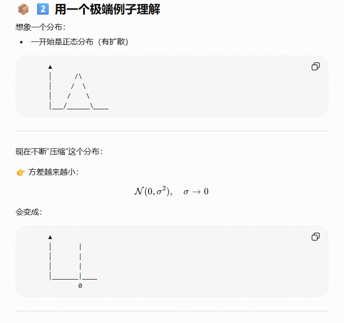
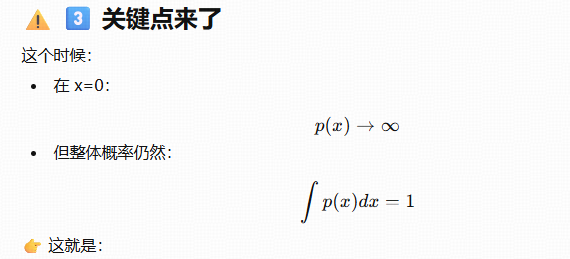

### 条件概率路径
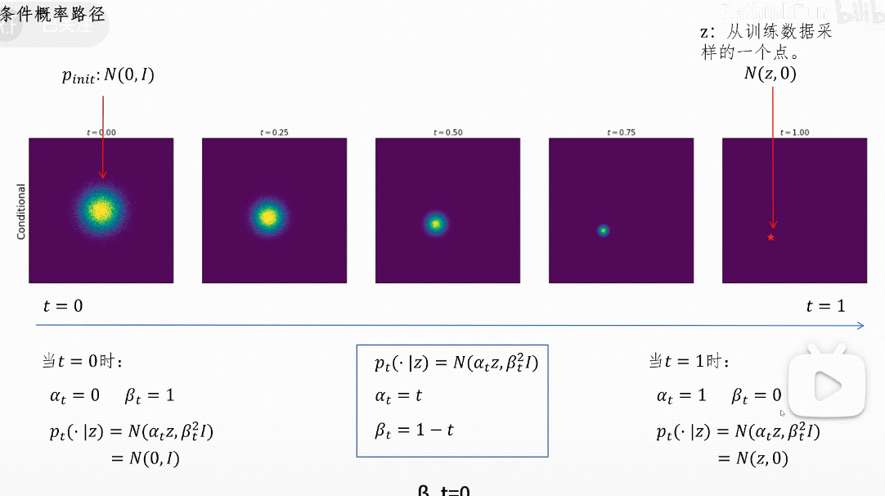

### 边缘概率路径

### 先构造一个流
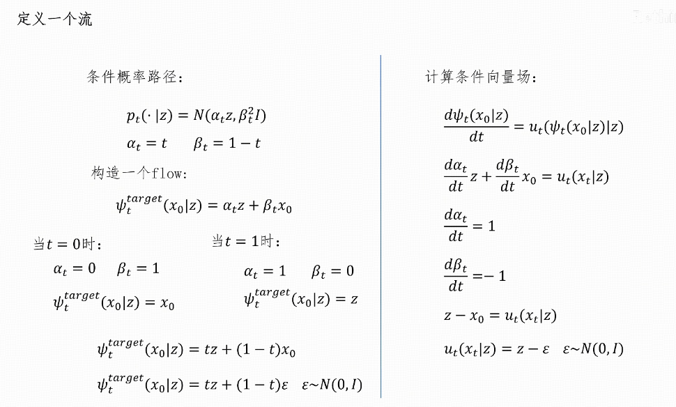

*通过这个构造的流推导出了条件向量场*

### 证明条件向量场与边缘向量场等价
如果这个条件向量场与边缘向量场等价那么就可以用户
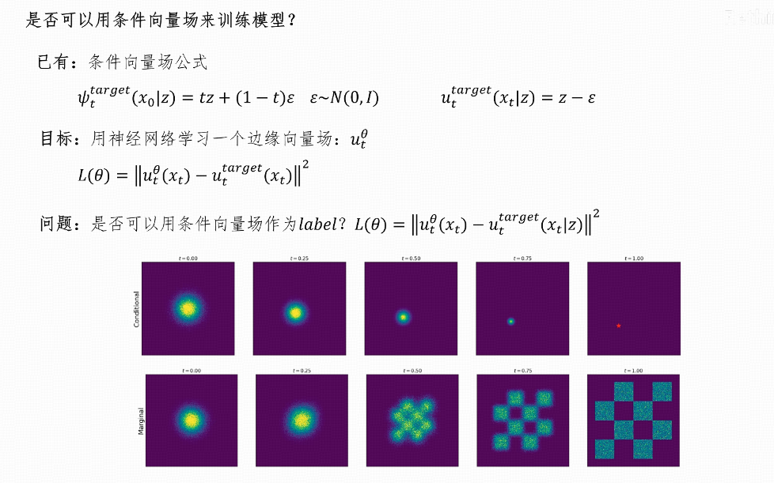

###  边缘向量成与条件向量场的关系
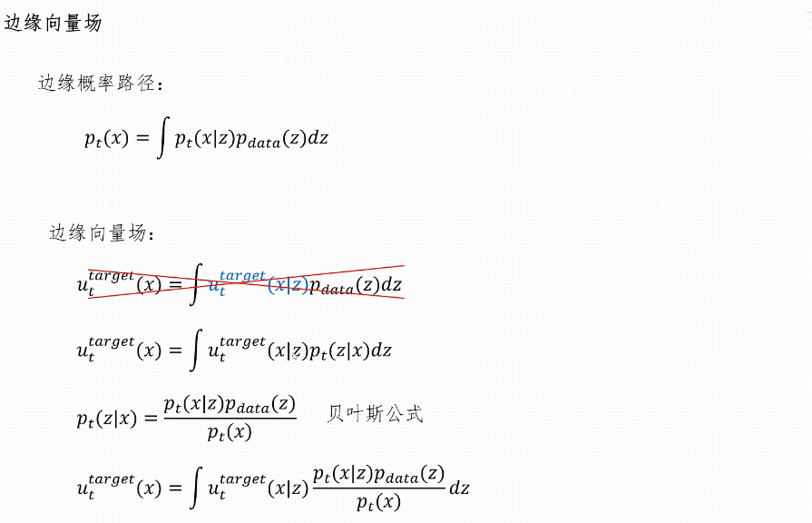

### 证明
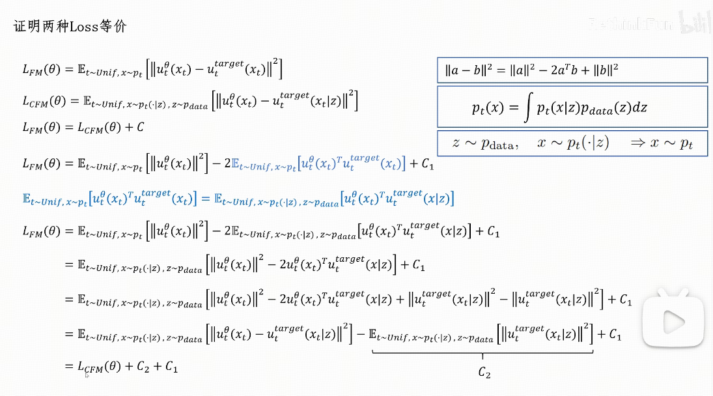

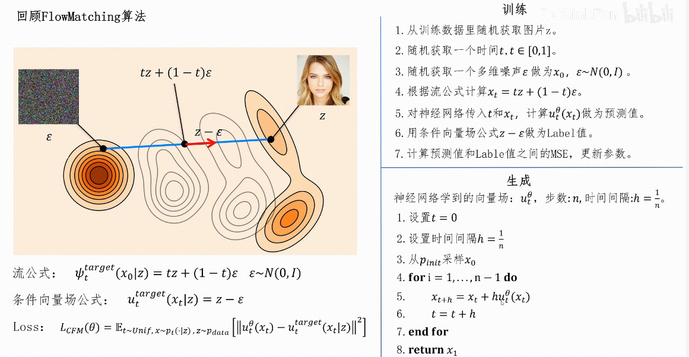

首先我们的label值就是图像减去噪声
我们就是为让模型学习这种 图像-噪声 的差值
后续推理的是我们只需要输入噪声让噪声减去这个差值就可以
这个差值就是总值
而模型训练的时候学习的是按照时间一步一步向目标值逼近的过程

而后学模型只要学习的每一步后续我们只要选取一个初始值作为噪声，模型就可以学习到推出这个噪声向目标label值之前的差值，然后我们加上这个差值就是向lablel值距离更近的噪声了，如此循环往复，就可以生成label值
差值就是朝向目标的更新量，而不是目标本身。
在每一步，把当前状态往“所有真实图像的分布区域”推近

### 