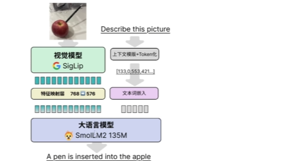
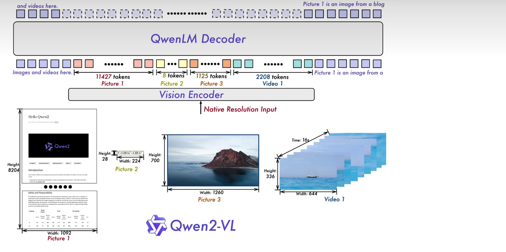
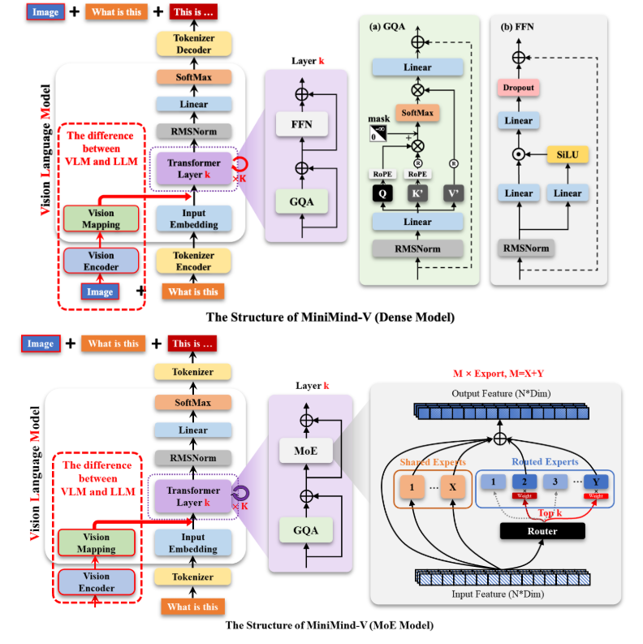

https://github.com/jingyaogong/minimind-v?tab=readme-ov-file

加入视觉编码器（冻结）（开源的预训练模型）

为实现维度对齐，需要过一个转换层 linear project 层
attention 层的实现
适配器

预训练的语言大模型

一开始使用占位符，后续将编码完成的图片向量与文本向量，（concat操作）输入到模型
image_tensor + tex_tensor
loss 看到是文本的loss
图片只算是外部特征信息
llm（qwen模型也是进行冻结）

答案和问题进行反向传播