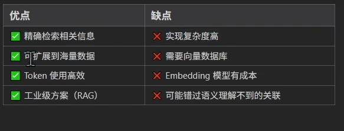
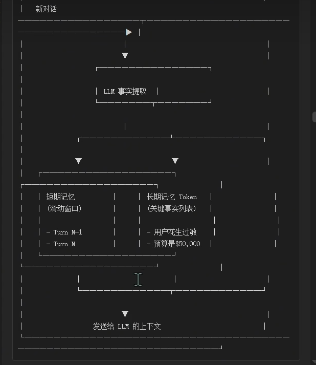
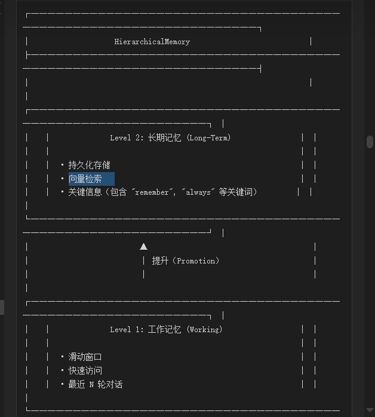
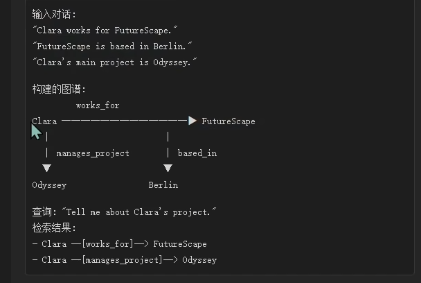
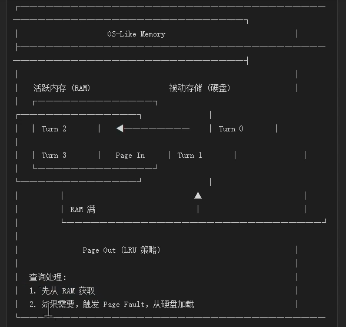
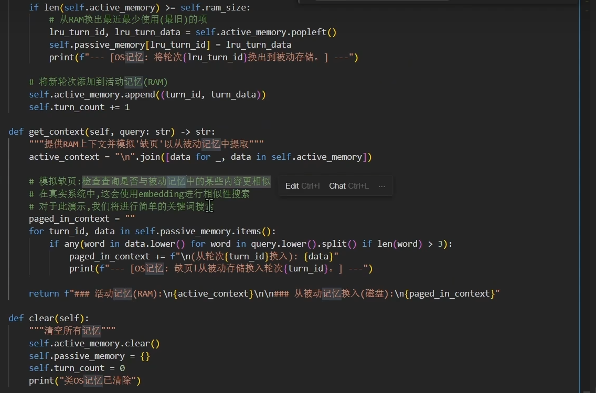
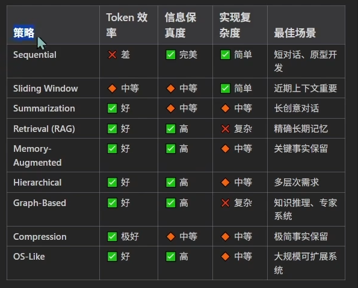

# agent 常见记忆策略

## 顺序记忆

## 滑动窗口记忆

## 摘要记忆

缓存区满了之后使用prompt 告诉大模型压缩记忆

## 检索记忆 rag

## 策略记忆增强

难点：长期记忆难以提取，如何判断哪些是事实。

## 层次化记忆

## 图谱记忆
用知识图谱存储实体关系，支持推理。

用大模型提取出主题关系和客体

## 压缩记忆

## 操作系统记忆

内存找到激活分页机制

ram(活跃内存) 硬盘（被动存储）+分页机制

存储内存或者硬盘中的衡量标准适应embedding模型进行判断是否与内存相关，相关索引出最相关的记忆，不相关，则将最不想管的记忆扔到硬盘中

# 记忆策略比较
