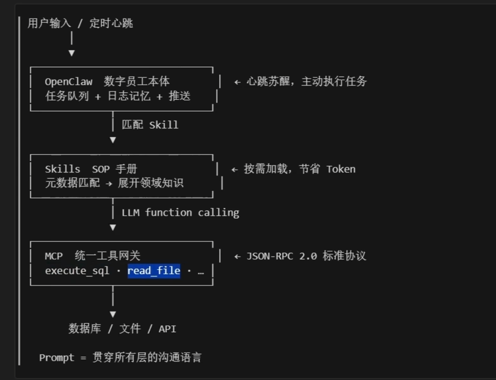
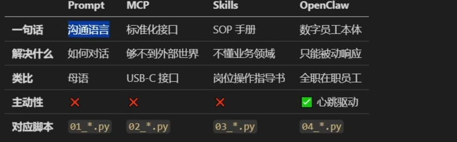
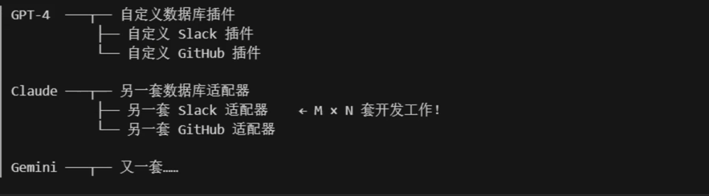
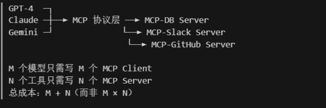

prompt 是模型沟通的语言
mcp 是连接世界的双手
skills 是按照需求加载的SOP(standed Operating Produce) 手册 
OpenClaw 主动干活的数字员工

## mcp 解决的核心问题

没有mcp（碎片集成）:每个模型都要为每个员工单独开发适配器

有了mcp（标准化接口）模型和工具各自实现统一的标准化接口

使用过mcp 调用高德官方的mcp