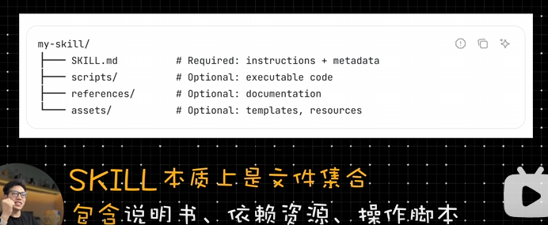
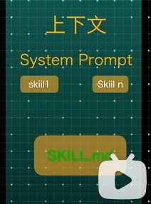
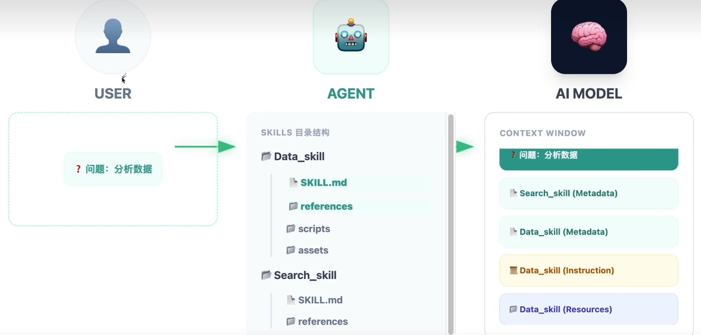
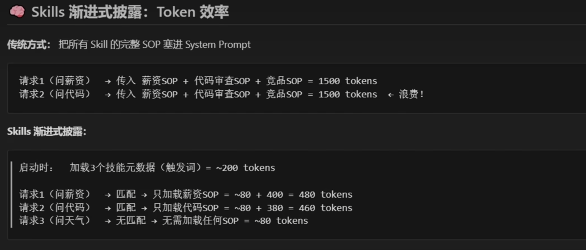

# agent skill 技能

agent 配置

## 启动时

agent启动的时候加载每个skill 名字和简介注入到Agent System Prompt 中

启动成本低

## 触发时

### 自动时
当你的prompt匹配某个skill ai模型自己决定要调用load_skill()

### 手动时

显示指定

``
\
``
嘛详细

### 执行时

Agent遵循skill.md 指令
根据需要选择性加载参考文件或者执行捆绑代码

## 渐进式披露

