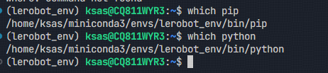

pip 常见使用

👉 pip 是 Python 的包管理工具
👉 用来：安装 / 卸载 / 管理依赖

默认从：
👉 PyPI 下载包

# 核心功能

```
pip install numpy

pip install numpy=1.26.0

pip install -U numpy

pip uninstall numpy

pip list

pip show numpy


pip freeze > requirements.txt

pip install -r requirements.txt

# -e = editable （开发模式）
pip install -e.

pip install -e ".[pi]"

# 查看配置

pip config list

pip config set global.index-url http://pypi.org/simple

pip config unset global.index-url
```


``
# 确保安装了最新版 huggingface_hub
pip install -U huggingface_hub

# 下载 pi0_base 到指定目录
huggingface-cli download lerobot/pi0_base --local-dir /home/ksas/models/pi0_base
``

